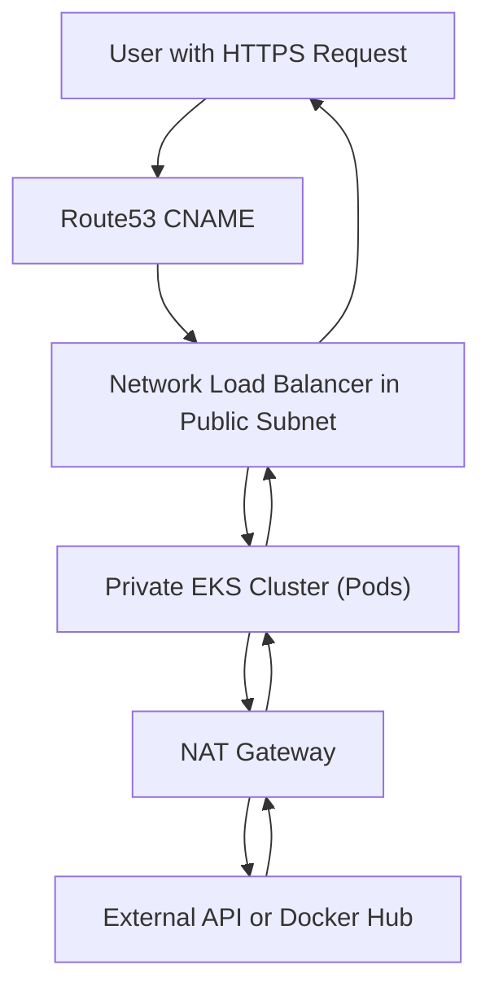
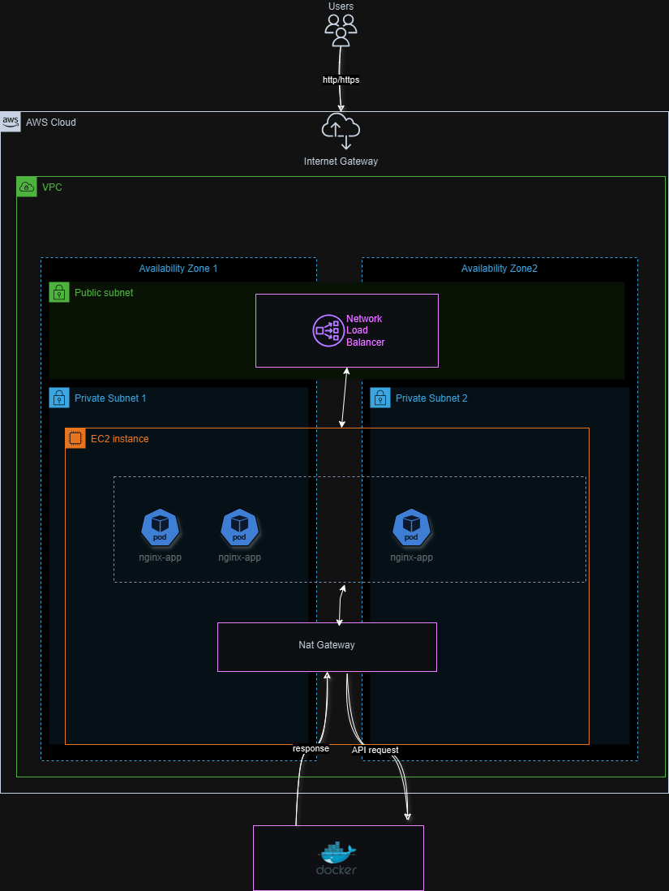

# DevOps Workshop

Welcome to the DevOps Workshop! This repository contains essential configuration files and resources for deploying and managing modern cloud infrastructure and containerized applications. This project was developed as part of a comprehensive course provided by Wix, under the mentorship of the senior DevOps team.

---

## Repository Structure

### Terraform Configuration Files

1. **`config.tf.json`**
   - Specifies backend and provider configurations for Terraform in JSON format.

2. **`bucket-policy.json`**
   - S3 bucket policy defining access control rules.

3. **`iam_policy.json`**
   - IAM policy for managing AWS resource permissions.

4. **`lb-trust-policy.json`**
   - Trust policy for the load balancer role.

5. **`main.tf`**
   - Core Terraform configuration defining infrastructure components:
     - Subnets
     - Route Table
     - S3 Bucket Policy
     - EKS Cluster
     - Route53 Records

6. **`provider.tf`**
   - AWS provider configuration for Terraform.

7. **`vars.tf`**
   - Variables for dynamic and reusable Terraform configurations.

---

### Kubernetes Deployment Files

1. **`nginx-deployment.yaml`**
   - Kubernetes Deployment manifest for an NGINX application.
   - Configures replica counts, container image, and resource limits.

2. **`nginx-service.yaml`**
   - Kubernetes Service manifest for exposing the NGINX application.
   - Configures the service as a LoadBalancer with specific ports.

3. **`service-account.yaml`**
   - Configures a Kubernetes service account for secure resource access.

---

### Helm Configuration

1. **`values.yaml`**
   - Configurable parameters for Helm chart deployments.
   - Although not used directly, it's included for future use.

---

### Other Files

1. **`.gitignore`**
   - Specifies files and directories ignored by Git.

2. **`aws-auth.yaml`**
   - AWS authentication configuration for EKS.

3. **`aws-lbc.tf`**
   - Terraform configuration for setting up an AWS Load Balancer Controller.

---

## Prerequisites

Ensure the following tools are installed and configured:

- [Terraform](https://www.terraform.io/downloads.html)
- [kubectl](https://kubernetes.io/docs/tasks/tools/)
- [helm](https://helm.sh/docs/intro/install/)
- AWS CLI with credentials configured.
- Access to a Kubernetes cluster.

---

### Setting Up Infrastructure

Follow these steps to provision infrastructure:

1. **Initialize Terraform:**

   ```bash
   terraform init
   ```

2. **Plan the infrastructure changes:**

   ```bash
   terraform plan
   ```

3. **Apply the infrastructure changes:**

   ```bash
   terraform apply
   ```

---

### Deploying to Kubernetes

Once the infrastructure is provisioned, deploy your Kubernetes resources:

1. **Deploy NGINX Application:**

   ```bash
    kubectl apply -f nginx-deployment.yaml
    kubectl apply -f nginx-service.yaml
   ```

2. **Verify the deployment:**

   ```bash
   kubectl get deployments
   kubectl get services
   ```

---


### Using Helm (For Future Use)

1. Deploy a Helm chart with custom values:

   ```bash
   helm install my-release -f values.yaml <chart-name>
   ```

2. Verify the Helm release:

   ```bash
   helm list
   ```

---


## Infrastructure Resource Flow Diagram

Below is a detailed resource flow diagram created using Mermaid. It illustrates how user requests are processed through Route53, Load Balancer, EKS Cluster, and other resources:



---

## Infrastructure and Network Architecture


Below is a high-level architecture diagram created with draw.io. It includes details about VPCs, subnets, and how components like the Load Balancer, EKS Cluster, and NAT Gateway are connected:



---

## Notes

- Validate values.yaml and Terraform files before deployment.
- Customize IAM and S3 bucket policies as needed for your use case.
- Ensure your Kubernetes context is properly set before applying any configurations.
- Review and customize the `values.yaml` file for specific deployment requirements.
- Validate your Terraform code before applying it to prevent misconfigurations.

---

## Support

If you encounter any issues or have questions, feel free to reach out .

---

## License

This project is licensed under the MIT License.


